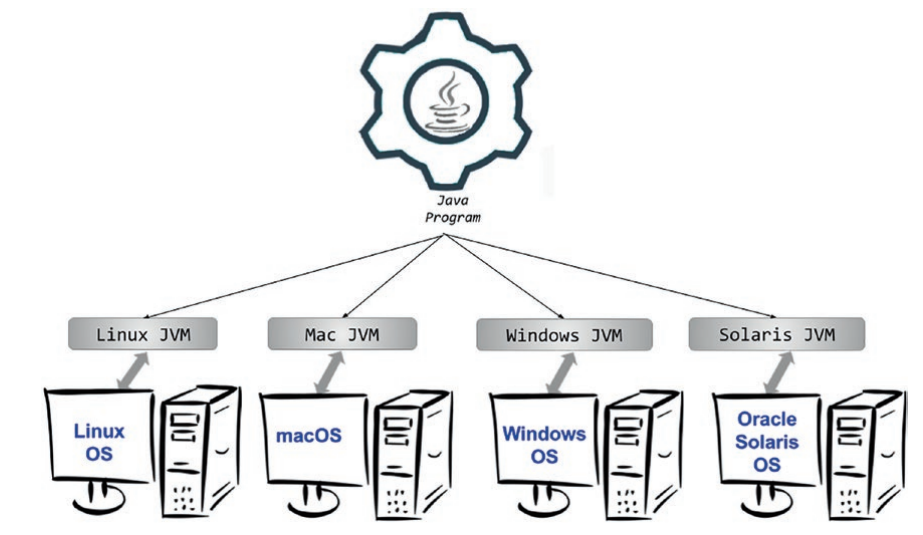
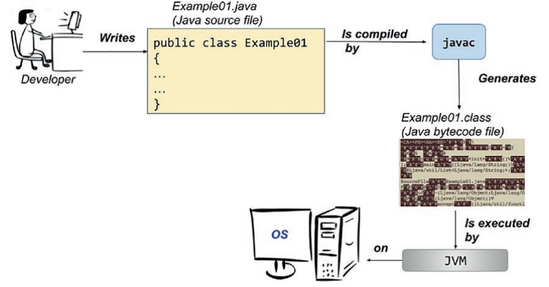

# An Introduction to Java and Its History

<!-- TOC -->

- [An Introduction to Java and Its History](#an-introduction-to-java-and-its-history)
  - [Who This Book Is For](#who-this-book-is-for)
  - [How This Book Is Structured](#how-this-book-is-structured)
  - [Conventions](#conventions)
  - [How Is Java Portable?](#how-is-java-portable)

<!-- /TOC -->

According to Google Search, at the end of 2020, 9492 companies reportedly use Java in their tech stacks, including Google and the company that I, the author of this book, worked for while this book was being written. Even after 25 years, Java continues to be one of the most influential programming languages. It all started in 1990, when an American company that was leading the revolution in computer industry decided to gather its best engineers to design and develop a product that would allow them to become an important player in the new emerging Internet world. Among those engineers was James Arthur Gosling, a Canadian computer scientist who is recognized as the father of the Java programming language. It would take five years of design, programming, and one renaming (from Oak to Java because of trademark issues), but finally, in January 1996, Java 1.0 was released for Linux, Solaris, Mac and Windows.

The general tendency when reading a technical book is to skip the introductory chapter altogether. But in this case I think it would be a mistake. I was never much interested in the history of Java until I wrote this book. I knew that James Gosling was the creator and that Oracle bought Sun, and that was pretty much it. I never cared much about how the language evolved, where the inspiration came from, or how one version was different from another. I started learning Java at version 1.5, and I took a lot of things in the language for granted. So when I was assigned to a project running on Java 1.4 I was quite confused, because I did not know why parts of the code I wrote was not compiling. Although the IT industry is moving very fast, there will always be that one client that has a legacy application. Knowing the peculiarities of each Java version is an advantage, because you know the issues when performing a migration.

When I started doing research for this book, I was mesmerized. The history of Java is interesting because it is a tale of incredible growth, success of a technology, and an example of how a clash of egos in management almost killed the company that created it. Currently Java is the most-used technology in software development, and it is simply paradoxical that the company that gave birth to it no longer exists. This chapter describes each version of Java, tracking the evolution of the language and the Java Virtual Machine.

## Who This Book Is For

Most Java books for beginners start with the typical Hello World! example depicted in Listing 1-1.

```java
public class HelloWorld {
 public static void main(String[] args) {
 System.out.println("Hello World!");
 }
}
```

This code, when executed, prints Hello World! in the console. But if you have bought this book it is assumed that you want to develop real applications in Java, and have a real chance when applying for a position as a Java developer. If this is what you want and if this is who you are, a beginner with the wits and the desire to make full use of this language’s power, then this book is for you. And this is why I will give you enough credit to start this book with a more complex example.

Java is a language with a syntax that is readable and based on the English language. So if you have logical thinking and a little knowledge of the English language, it should be obvious to you what the code in Listing 1-2 does without even executing it.

Listing 1-2. The Java Beginner Code Sample a Smart Beginner Deserves

```java
package com.apress.ch.one.hw;
import java.util.List;
public class Example01 {
 public static void main(String[] args) {
 List<String> items = List.of("1", "a", "2", "a", "3", "a");
 items.forEach(item -> {
 if (item.equals("a")) {
 System.out.println("A");
 } else {
 System.out.println("Not A");
 }
 });
 }
}
```

In this code example, a list of text values is declared; then the list is traversed, and when a text is equal to “a”, the letter “A” is printed in the console; otherwise, “Not A” is printed.

If you are an absolute beginner to programming, this book is for you, especially because the sources attached to this book make use of algorithms and design patterns commonly used in programming. So if your plan is to get into programming and learn a high-level programming language, read the book, run the examples, write your own code, and you should have a good head start.

If you already know Java you can use this book too, because it covers syntax and under-the-bonnet details for Java versions up to 17 (the Early Access Program or EAP2 release), and you will surely find something you did not know.

## How This Book Is Structured

The chapter you are currently reading is an introductory one that covers a small part of Java history, showing you how the language has evolved and providing a glimpse into its future. Also, the mechanics of executing a Java application are covered, so that you are prepared for Chapter 2. The next chapter will show you how to set up your development environment and will introduce you to a first simple application.

Starting with Chapter 3, fundamental parts of the language will be covered: packages, modules, classes, interfaces, annotations objects, operators, data types, records, statements, streams, lambda expressions, and so on.

Starting with Chapter 8, interactions with external data sources are covered: reading and writing files, serializing/deserializing objects, and testing and creating an user interface.

Chapter 12 is dedicated fully to the publish-subscribe framework introduced in Java 9 and reactive programming.

Chapter 13 will cover the Garbage Collector.

All the sources used in the listings in this book, and some that did not make it because the book must be kept to a reasonable size, are part of a project named java-17-for-absolute-beginners. This project is organized in modules (thus it is a multimodule project) that are linked to each other and have to be managed by something called Maven. Maven is something we developers call a build tool, and it provides the capability to build projects containing a lot of source code. To build a project means transforming the code written into something that can be executed. I choose to use multimodule projects for the books I write because it is easier to build them and also because common elements can be grouped together, keeping the configuration of the project simple and nonrepetitive. Also, by having all the sources organized in one multimodule project, you get the feedback if the sources are working or not as soon as possible, and you can contact the author and ask them to update them. I know that having a build tool introduces a certain level of complexity, but it gives you the opportunity to get comfortable with a development environment very similar to what you will work in as an employee.

## Conventions

This book uses a number of formatting conventions that should make it easier to read. To that end, the following conventions are used within the book:

- code or concept names in paragraphs appear as follows:
  `java.util.List`
- code listings appear as follows:

```java
public static void main(String[] args) {
System.out.println("Hello World!");
}
```

- logs in console outputs will appear as follows:

```
01:24:07.809 [main] INFO c.a.Application - Starting Application
01:24:07.814 [main] DEBUG c.a.p.c.Application - Running in
debug mode
```

- `{xx}` is a placeholder; the xx value is a pseudo-value giving a hint about the real value that should be used in the command or statement.
- appears in front of paragraphs you should pay specific attention to. There are similar icons for tips and warnings.
- Italic font is used for humorous metaphors and expressions.
- Bold font is used for Chapter references and important terms.

As for my style of writing, I like to write my books in the same way I have technical conversations with colleagues and friends: sprinkling jokes throughout, giving production examples, and making analogies to non programming situations. Because programming is nothing but just another way to model the real world.

Java 1.0 was released at the first edition of the JavaOne conference with over 6000 attendees. Java started out as a language named Oak.4 This language was really similar to C++ and was designed for handheld devices and set-top boxes. It evolved into the first version of Java, which provided developers some advantages which C++ did not:

- security: In Java, there is no danger of reading bogus data when accidentally going over the size of an array.
- automatic memory management: A Java developer does not have to check if there is enough memory to allocate for an object and then deallocate it explicitly; the operations are automatically handled by the garbage collector. This also means that pointers are not necessary.
- simplicity: There are no pointers, unions, templates, structures. Mostly anything in Java can be declared as a class. Also, confusion when using multiple inheritance is avoided by modifying the inheritance model and not allowing multiple class inheritance.
- support for multithreaded execution: Java was designed from the start to support development of multithreaded software.
- portability: One of the most known Java mottos is Write once, run anywhere (WORA). This is made possible by the Java Virtual Machine.

All this made Java appealing for developers, and by 1997, when Java 1.1 was released, there were already approximately 400,000 Java developers in the world. The JavaOne conference had 10,000 attendees that year. The path to greatness was set. Before going further in our analysis of each Java version, let’s clarify a few things.

## How Is Java Portable?

I mentioned a few times that Java is portable and that Java programs can run on any operating system. It is time to explain how this is possible. Let’s start with a simple drawing, like the one in Figure 1-4.



Java is what we call a high-level programming language that allows a developer to write programs that are independent of a particular type of computer. High-level languages are easier to read, write, and maintain. But their code must be translated by a compiler or interpreted into machine language (unreadable by humans because is it made up of numbers) to be executed, because that is the only language that computers understand.

In Figure 1-4, notice that on top of the operating systems, a JVM is needed to execute a Java program. JVM stands for Java Virtual Machine, which is an abstract computing machine that enables a computer to run a Java program. It is a platform-independent execution environment that converts Java code into machine language and executes it. So what is the difference between Java and other high-level languages? Well, other high-level languages compile source code directly into machine code that is designed to run on a specific microprocessor architecture or operating system, such as Windows or UNIX. What JVM does is to mimic a Java processor, making it possible for a Java program to be interpreted as a sequence of actions or operating system calls on any processor regardless of the operating system. Sure, the compiling step makes Java slower than a pure compiled language like C++, but the advantage was and is still beautiful. Also, Java is not the only member of the JVM languages family. Groovy, Scala, Kotlin, and Clojure are all very popular programming languages that run on the JVM.

Because the Java compiler was mentioned, we have to get back to Java 1.1, which was widely used even as new versions were released. It came with an improved Abstract Window Toolkit (AWT) graphical API (collections of components used for building applets), inner classes, database connectivity classes (JDBC model), classes for remote calls (RMI), a special compiler for Microsoft platforms named JIT5 Compiler (for Just In Time), support for internationalization, and Unicode. What also made it so widely embraced is that shortly after Java was released, Microsoft licensed it and started creating applications using it. The feedback helped further development of Java, and thus Java 1.1 was supported on all browsers of the time, which is why it was so widely deployed.

So what exactly happens to the developer-written Java code until the actual
execution? The process is depicted in Figure 1-5



Java code is compiled and transformed to bytecode that is then interpreted and executed by the JVM on the underlying operating system.

Now that we’ve covered how Java code is executed, let’s go back to some more history.
Java is a compiled and interpreted general-purpose programming language with numerous features that make it well suited for the web.

A lot of terms used in the introduction of the book might seem foreign to you
now, but as you read the book, more information is introduced, and these words will start to make more sense. For now, just keep in mind that every new Java version has something more than the previous version, and at that time, every new component was a novelty.
